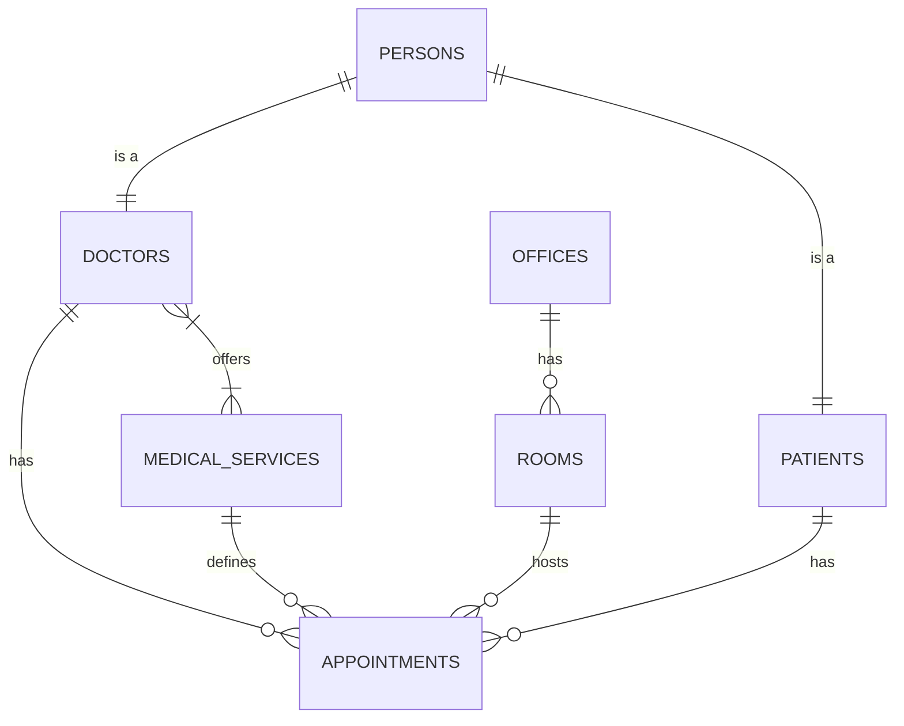

# Database Schema Design

This document details the database schema, updated to Phase 2.

## 1. Authentication & Users (Phase 1 - Approved)
*Inheritance Strategy: `persons` is the base table.*

### `roles`
- `id` (SERIAL PK), `name` (unique), `description`, `timestamps`

### `permissions`
- `id` (SERIAL PK), `name` (unique), `description`, `group_name`, `timestamps`

### `role_permissions`
- `role_id`, `permission_id` (PK Composite)

### `persons` (Base Table)
- `id` (BIGSERIAL PK), `role_id`, `first_name`, `last_name`, `email` (unique), `phone`, `password`, `gender`, `birth_date`, `document_type`, `document_number`, `address`, `city`, `state`, `country`, `photo_url`, `status`, `metadata`, `timestamps`, `deleted_at`

### `patients`
- `id` (BIGSERIAL PK), `person_id` (Unique Ref persons), `emergency_contact`, `allergies`, `medical_background`, `blood_type`, `special_notes`, `timestamps`

### `staff`
- `id` (BIGSERIAL PK), `person_id` (Unique Ref persons), `job_title`, `department`, `timestamps`

### `doctors`
- `id` (BIGSERIAL PK), `person_id` (Unique Ref persons), `professional_license`, `specialties`, `biography`, `consultation_price`, `availability` (JSONB), `credentials` (JSONB), `timestamps`

### `person_sessions`
- `id`, `person_id`, `session_token`, `ip_address`, `user_agent`, `timestamps`

### `verification_codes`
- `id`, `person_id`, `code`, `type`, `timestamps`

---

## 2. Appointments & Scheduling (Phase 2 - Proposed)

### `offices` (Sedes)
Physical locations of the clinic.
- `id` (SERIAL PRIMARY KEY)
- `name` (VARCHAR(150) NOT NULL)
- `address` (VARCHAR(255))
- `phone` (VARCHAR(50))
- `is_active` (BOOLEAN DEFAULT TRUE)
- `created_at`, `updated_at`

### `rooms` (Consultorios)
Rooms within an office.
- `id` (SERIAL PRIMARY KEY)
- `office_id` (INT NOT NULL REFERENCES offices(id) ON DELETE CASCADE)
- `name` (VARCHAR(100) NOT NULL) -- e.g., "Consultorio 101"
- `type` (VARCHAR(50)) -- 'consultation', 'procedure', 'surgery'
- `capacity` (INT DEFAULT 1)
- `created_at`, `updated_at`

### `medical_services` (Catálogo de Servicios)
Standard list of services offered.
- `id` (SERIAL PRIMARY KEY)
- `name` (VARCHAR(150) NOT NULL) -- e.g., "Consulta General", "Botox Full Face"
- `description` (TEXT)
- `default_price` (NUMERIC(10,2))
- `default_duration_minutes` (INT DEFAULT 30)
- `category` (VARCHAR(50))
- `is_active` (BOOLEAN DEFAULT TRUE)
- `created_at`, `updated_at`

### `appointments` (Agenda/Citas)
Core appointment records.
- `id` (BIGSERIAL PRIMARY KEY)
- `patient_id` (BIGINT NOT NULL REFERENCES patients(id) ON DELETE CASCADE)
- `doctor_id` (BIGINT NOT NULL REFERENCES doctors(id) ON DELETE CASCADE)
- `room_id` (INT REFERENCES rooms(id))
- `service_id` (INT REFERENCES medical_services(id))
- `scheduled_at` (TIMESTAMPTZ NOT NULL) -- Start time
- `end_at` (TIMESTAMPTZ NOT NULL) -- End time
- `status` (VARCHAR(30) DEFAULT 'scheduled')
  - Values: `scheduled`, `confirmed`, `checked_in`, `in_progress`, `completed`, `cancelled`, `no_show`
- `price_agreed` (NUMERIC(10,2)) -- Price at the moment of booking
- `reason_for_visit` (TEXT)
- `internal_notes` (TEXT)
- `created_at`, `updated_at`
- `cancelled_at` (TIMESTAMPTZ)
- `cancellation_reason` (TEXT)

### `doctor_services`
Links doctors to services they perform (optional override for price/duration).
- `doctor_id` (BIGINT REFERENCES doctors(id))
- `service_id` (INT REFERENCES medical_services(id))
- `custom_price` (NUMERIC(10,2) NULL)
- `custom_duration` (INT NULL)
- PRIMARY KEY (`doctor_id`, `service_id`)

### `appointment_audits`
Tracks history of changes for appointments (status changes, rescheduling).
- `id` (BIGSERIAL PRIMARY KEY)
- `appointment_id` (BIGINT NOT NULL REFERENCES appointments(id) ON DELETE CASCADE)
- `changed_by` (BIGINT REFERENCES persons(id)) -- Who made the change
- `old_status` (VARCHAR(30))
- `new_status` (VARCHAR(30))
- `change_reason` (TEXT) -- Optional note for why the change happened
- `changes` (JSONB) -- Detailed field changes (e.g., {"start_time": {"old": "...", "new": "..."}})
- `created_at` (TIMESTAMPTZ DEFAULT NOW())

## Relationships Diagram (Mermaid)

